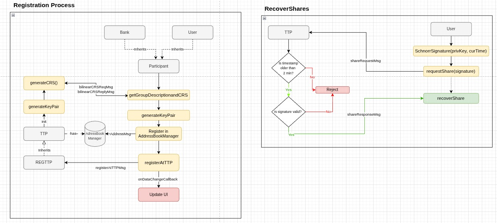
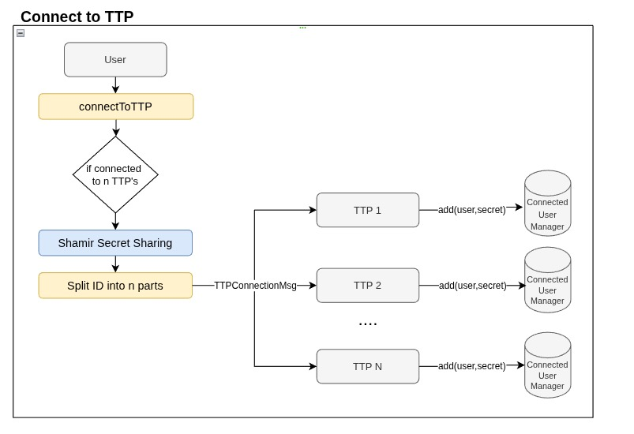
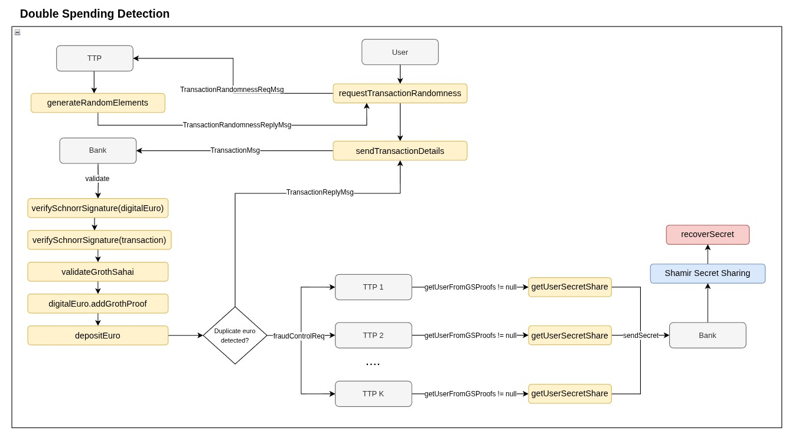

# Offline Euro – Extension: Distributed TTPs and Privacy-Preserving Identity Recovery (Euro 1 Team 4)

Members:
- Dorian Erhan - 5580277
- Ivans Kravcevs - 5450535
- Dennis Heijmans - 5444993
- Dimitris Ntatsis - 6216269
- Jamila Seyidova - 5796806

We preserved the original README in [`README-original.md`](README-original.MD) for reference.

## Multiple TTPs
This project extends the EuroToken system by replacing the single Trusted Third Party (TTP) used during the user identification and initialization phase with a distributed network of multiple TTPs.

In this new design, users register with multiple TTPs instead of one, and no single TTP holds enough information to identify a user on its own.

A quorum of TTPs must collaborate to reconstruct the user's identity in the event of a double-spending incident.

The goal of this change is to enhance user privacy and reduce the risk of a single point of failure.

This system assumes that a threshold (>=K) of TTPs remains honest.

Even if some TTPs collude or go offline during the deanonymization process, the user’s identity remains protected unless the quorum is reached.

## Shamir Secret Sharing

To support this functionality, we integrated [Codahale’s Shamir Secret Sharing Java library](https://github.com/codahale/shamir), which allows a secret to be split into multiple parts, such that only a defined threshold of parts (k out of n) is required to reconstruct it.

This approach is based on the mathematical foundations introduced by Shamir and further discussed in [Bogdanov, 2007].

## Schnorr signatures

We also added support for Schnorr signatures on the user side.

Users can now send blinded Schnorr signature requests to the TTP and later recover and verify the signature.

This feature strengthens unlinkability while maintaining cryptographic proof of ownership.

In addition, we use these Schnorr signatures during share recovery to prevent malicious users from requesting secret shares with fake or replayed messages.

Each request includes a timestamp and a unique user identifier, signed using the user’s private key. On the TTP side, the signature is verified and the message is only accepted if it is fresh and comes from a known, trusted sender.

## Double Spending

In addition, we implemented the communication protocol between the bank and TTPs that is triggered during a double-spending event.

When such an event is detected, the bank contacts multiple TTPs to collaboratively reconstruct the user’s identity.

When a sufficient number of TTPs respond with valid shares, then bank reconstructs user's secret from them.

## All-Roles Demo

Lastly, we created a demo that integrates all the roles involved in the protocol, including users, the bank, and multiple TTPs.

The demo showcases the full flow: registration with distributed TTPs, secret sharing, secret recovery via Schnorr signature interaction, and bank identity and secret recovery through collaboration in case of fraud.

### Registration and Secret Recovery Flow

### Connecting to TTPs

### Double Spending Detection and Identity Reconstruction Flow

## Future Work

We consider the following to be possible as a continuation of this project:

- Expand the secret to be more complex than a string (replacing it with EUDI Wallet or some sort of external identifier)
- Modify communication behaviour to simulate inactive/byzantine TTPs
- Perform more extensive testing with multiple devices
- Add WebOfTrust elements to limit the transaction abilities of fraudster users.

## References

- Bogdanov, D. *Foundations and Properties of Shamir's Secret Sharing Scheme*. Research Seminar in Cryptography, University of Tartu, Institute of Computer Science, May 1st, 2007.
